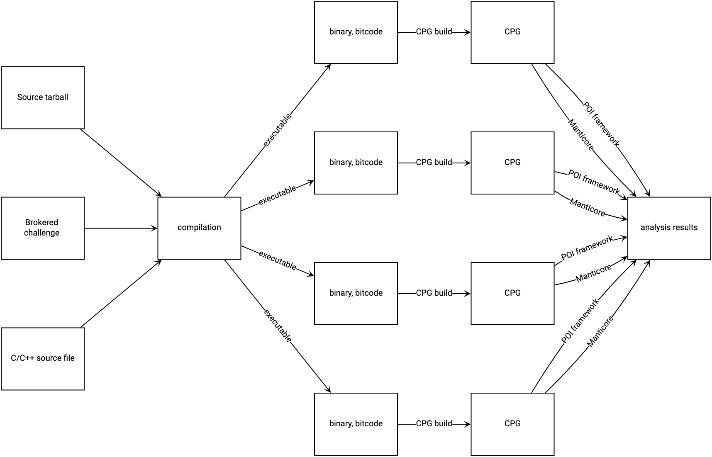
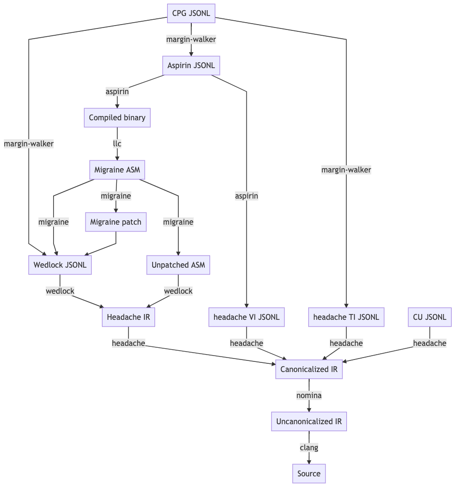

############
Architecture
############

This page provides an index of tools and components within MATE. For a
higher-level overview of MATE, see :doc:`overview`.

.. _analysis_workflow:

Analysis Workflow
-----------------

The MATE workflow can be visualized as a transition from some source-code
representation of a program, to a compilation that can produce one or more
executables, to one :doc:`CPG <cpg>` build per executable, and finally to
individual analyses run on each CPG:

..
  NOTE(ww): Keep this up-to-date with the image below!
  Use https://flowchart.fun to re-render any changes.

  ~~~
  layout:
    name: dagre
    rankDir: LR
  ~~~

  ingest: Source tarball
    (compilation)
  ingest: Brokered challenge
    (compilation)
  ingest: C/C++ source file
    [compilation] compilation
      executable: binary, bitcode
        CPG build: CPG
          Manticore: (analysis)
          [analysis] POI framework: analysis results
      executable: binary, bitcode
        CPG build: CPG
          Manticore: (analysis)
          POI framework: (analysis)
      executable: binary, bitcode
        CPG build: CPG
          Manticore: (analysis)
          POI framework: (analysis)
      executable: binary, bitcode
        CPG build: CPG
          Manticore: (analysis)
          POI framework: (analysis)

System architecture
-------------------

The MATE system is decomposed into eight services:

server
   The ``server`` component presents :doc:`a REST API <using-rest-api>` that can
   be used to initiate individual steps of the analysis workflow depicted above.
   This API allows users to manually run analysis steps with custom options or
   changes in response to errors. The server API also implements backend queries
   for MATE UI components including Flowfinder.

executor
   The ``executor`` component asynchronously processes long-running
   requests initiated by the ``server`` component, such as program
   compilation, CPG generation, and :doc:`POI analyses <pois>`.

db
   The ``db`` component runs a standard PostgreSQL installation and
   stores all generated Code Property Graphs. Other components
   (including other components of MATE) can access CPGs via the MATE
   domain-specific query language connected to the database. In addition
   to storing CPGs, the ``db`` component stores all persistent MATE
   system state.

storage
   The ``storage`` component supplements the ``db`` component with a
   MinIO object store and is used to store large analysis artifacts
   such as program source code, compiled binaries, and logs.

broker
   The ``broker`` component is a MATE-internal message bus used to
   coordinate MATE components.

mate-ui
   The ``mate-ui`` component serves a web-based user-interface to the MATE
   system. It provides access to :doc:`Flowfinder <using-flowfinder>`,
   :doc:`under-constrained-manticore`, and an interface to monitor the
   compilation and CPG generation processes.

notebook
   The ``notebook`` component provides a :doc:`Jupyter notebook environment
   <using-notebooks>` for interacting with the MATE system via :ref:`the Python
   domain-specific query language <overview_query>`.

mantiserve
   The ``mantiserve`` component exposes :doc:`a REST API <mantiserve>` for
   running symbolic execution queries against programs. The API allows symbolic
   execution tasks to be parameterized by specific detector plugins that monitor
   for potential vulnerabilities.

Docker Images and Compositions
------------------------------

The above services are deployed in Docker containers using ``docker-compose``.

Docker Images
=============

First-Party
~~~~~~~~~~~

The following images are built from the top-level ``Dockerfile`` in CI, and can
be built manually by supplying the ``--target`` flag to ``docker build``. The
default target is ``dev``. By convention, the images are usually tagged with the
target names prefixed by ``mate-``, e.g., ``mate-dist``.

- ``dev``: An image with all of the tools necessary to develop MATE, including
  build systems, complilers, linters, etc.
- ``dist``: An image with MATE installed
- ``notebook``: Jupyter Notebook server
- ``ui``: Web UI components (Flowfinder, builds page, etc.)

Third-Party
~~~~~~~~~~~

These images are used in MATE compositions, but contain third-party software.

- ``postgres``: Used for the ``db`` component (described above)
- ``rabbitmq``: : Used for the ``broker`` component (described above)
- ``minio``: Used for the ``storage`` component (described above)

Docker Compositions
===================

MATE has several ``docker-compose.*.yml`` files. These are generally run in
conjunction with ``docker-compose.yml``, e.g.::

  docker-compose -f docker-compose.yml -f docker-compose.ui.yml up

On especially powerful hosts, ``docker-compose.yml`` can be replaced with
``docker-compose.large.yml``. Each of the other compositions runs particular
services:

- ``.clients.yml``: Run an IPython (Jupyter) shell from the command-line,
  without using the MATE Notebooks service.
- ``.notebook.yml``: Runs the ``notebook`` service, see :doc:`using-notebooks`.
- ``.test.yml``: Used by MATE developers to test MATE, see :doc:`hacking`.
- ``.ui.dev.yml``: Used by MATE developers to develop MATE, see :doc:`hacking`.
- ``.ui.yml``: Runs the ``mate-ui`` service.

Component index
---------------

..
   For components which have a more extensive primary reference page (e.g.,
   POIs), the sections below should provide less detailed information and a link
   to the primary reference material.

Compilation components
======================

The following tools and components are responsible for compiling a program into an
LLVM bitcode module that is suitable for CPG generation.

.. _Blight_desc:

blight
~~~~~~

Provenance: Trail of Bits (`GitHub <https://github.com/trailofbits/blight>`__)

``blight`` is a build tool wrapper for C/C++ compilers (``cc`` and ``c++``) as well as the
standalone preprocessor (``cpp``), assembler (``as``), linker (``ld``), and other standard
build tools.

MATE uses ``blight`` for instrumenting arbitrary program build systems, ensuring that
they can be eventually ingested as CPGs. ``blight``'s responsibilities include:

#. Ensuring that MATE's required compilation flags are *always* passed to individual compiler
   invocations.
#. Saving an accurate record of each step in a build process, to improve recompilation fidelity.
#. Saving an accurate record of each output of each build step, so that multiple independent
   CPGs can be produced from a build system that produces more than one executable.
#. Dispatching to :ref:`gllvm_desc` for bitcode generation.

.. _gllvm_desc:

GLLVM
~~~~~

Provenance: SRI-CSL (3rd-party, `GitHub <https://github.com/SRI-CSL/gllvm>`__)

GLLVM is a suite of tools for wrapping ``clang`` and ``clang++`` to emit bitcode for every
intermediate output, as well combining those intermediate bitcode outputs into a unified
LLVM IR module.

.. _compile_desc:

Compilation tasks
~~~~~~~~~~~~~~~~~

Provenance: Trail of Bits

The ``frontend/mate/mate/build/compile.py`` module manages the process of
compiling programs submitted to MATE while monitoring and controlling the build
process to create artifacts that can be analyzed by other MATE components. This
module is responsible for creating Docker environments in which to compile
programs on demand, inferring build system configurations and necessary
options, and creating and storing artifacts for further analysis.

CPG generation components
=========================

The following tools and components are responsible for generating various components of the CPG.

.. _LLVM_passes_desc:

LLVM middle-end passes
~~~~~~~~~~~~~~~~~~~~~~

Provenance: Galois

There are three middle-end passes which read in LLVM bitcode and spew out analysis results. They are loaded dynamically using ``opt``. Consult the LLVM documentation to learn about loading passes into ``opt``.

- The :ref:`pointer analysis <points_to_desc>` lives in ``llvm/PointerAnalysis/``.

- Many nodes and edges of the CPG are created in
  ``llvm/MATE/ASTGraphWriter.cpp``, :ref:`including <cpg_provenance>`: the LLVM
  AST, intra-procedural CFGs, intra-procedural (non-memory) DFGs, and the CDG.
  ``ASTGraphWriter`` also formats the output of the pointer analysis for
  inclusion in the CPG.

- Basic blocks are instrumented to generate :doc:`traces <trace>` for dynamic
  analysis in ``llvm/MATE/TraceLogger.cpp``.

Known Problems: ASTGraphWriter does not properly handle exceptional control
flow; such exceptional flows will not be reflected in higher-level tools like
Flowfinder or notebook queries.

Expected Problems: ASTGraphWriter may be unaware of the semantics of more
obscure LLVM instructions and intrinsics.

.. _points_to_desc:

Points-to analysis
~~~~~~~~~~~~~~~~~~

Provenance: Galois

MATE's code property graph representation is built on top of the results of a
precise, context-sensitive, whole-program points-to analysis that allows for
accurate, narrow tracking of data- and control-flow through the program under
analysis.

The points-to analysis implementation is located in the ``llvm/PointerAnalysis``
directory.

See `the upstream documentation <https://galoisinc.github.io/cclyzerpp/>`_ for
more information.

Known problems: Refer to the upstream documentation.

.. _Machine_desc:

Machine-code mapping tools
~~~~~~~~~~~~~~~~~~~~~~~~~~

These tools are responsible for incorporating binary-level information into the CPG and linking
binary-level information against the core LLVM CPG elements.

.. _Nomina_desc:

Nomina
++++++

Provenance: Trail of Bits

Nomina is an LLVM pass responsible for canonicalizing the names
of basic blocks in LLVM bitcode. Nomina's canonicalization enables
different versions of LLVM running on potentially separate machines
to consistently identify the same basic blocks and associate them
with other program features.

Known problems: None

Expected problems: None

.. _Headache_desc:

Headache
++++++++

Provenance: Trail of Bits

Headache is an LLVM pass with a collection of responsibilities:

- Extracting information about each compilation (i.e., translation) unit in the bitcode module
- Extracting variable information (VI) about each global, local, and argument in the bitcode module
- Extracting deduplicated DWARF type information (TI), for later pairing with the VI

Headache's compilation unit information extraction is used to inform :ref:`quotidian_desc`'s
recompilation.

Known problems: Headache's type extraction for template parameters is incomplete.

Expected problems: Headache performs scope unrolling to present a full picture of the lexical
scope in which a variable appears. The complexities of DWARF mean that there are probably
unhandled edge cases in Headache's scope handling.

.. _Wedlock_desc:

Wedlock
+++++++

Provenance: Trail of Bits

Wedlock is a *backend* LLVM pass responsible for pairing the IR representation of a bitcode
module with LLVM's "middle-end" representation.

Known problems: Pretty-printing LLVM's MIR is slow, so Wedlock doesn't do it by default.

Expected problems: Wedlock observes program features that are only produced during LLVM's code
generation phrase, such as ``%unwind_resume`` blocks for DWARF-style exception handling.
These can't be easily paired with the IR blocks seen during processing in LLVM frontend passes
(i.e. :ref:`Nomina_desc` and ASTGraphWriter) because they don't exist in the IR
until lowering begins.

.. _migrane_desc:

migraine
++++++++

Provenance: Trail of Bits

migraine is a Python module and utility responsible for emitting a patch of assembler directives
based on :ref:`Wedlock_desc`'s output. migraine's assembler directive patch is later used during
recompilation to generate a special ``.migraine_addrs`` section that :ref:`aspirin_desc` uses for
basic block pairing.

Known problems: None.

Expected problems: None.

.. _aspirin_desc:

aspirin
+++++++

Provenance: Trail of Bits

aspirin is a Python module and utility with a collection of responsibilities:

- Pairing each IR-level function and basic block with layout information
  (i.e. virtual address, offset, and size) in the "canonical" compiled binary
- Pairing :ref:`Headache_desc`'s variable information with each parameter and local variable in the
  compiled binary, including scoping information

Known problems: aspirin's handling of inlined functions, scopes, and variables is probably
deficient due to DWARF's complexity.

Expected problems: None.

.. _margin_walker_desc:

margin-walker
+++++++++++++

Provenance: Trail of Bits

margin-walker is a Python module and utility responsible for emitting MATE-compatible CPG records
based on the combined input of :ref:`Wedlock_desc` and :ref:`aspirin_desc`, as well as
:ref:`Headache_desc`'s type information.

Known problems: None.

Expected problems: margin-walker's runtime and memory usage will probably grow (roughly)
quadratically with program size.

.. _quotidian_desc:

quotidian
+++++++++

Provenance: Trail of Bits

quotidian is a Python module and utility that represents the primary ingress and egress for all Trail of Bits
provided instrumentation. It takes *either* a bitcode input *or* a G/WLLVM-compiled binary input.

quotidian does not require :ref:`Nomina_desc` to be run in the input bitcode beforehand. However,
failing to do so and using quotidian's bitcode elsewhere *will* cause canonicalization issues.

Known problems: None.

Expected problems: None.

Machine code mapping dependencies
+++++++++++++++++++++++++++++++++

The following depicts the dependency relations between various Trail of Bits tools and the JSONL ultimately
generated for insertion into the CPG.

The above image should be kept up-to-date with the following
MermaidJS specification::

    graph TD
    A[CPG JSONL] --> |margin-walker|E[Wedlock JSONL]
    A --> |margin-walker|L
    F --> |migraine|E
    F --> |migraine|G[Migraine patch]
    G --> E
    F --> |migraine|H[Unpatched ASM]
    E --> |wedlock|I[Headache IR]
    H --> |wedlock|I
    I --> |headache|J[Canonicalized IR]
    J --> |nomina|K[Uncanonicalized IR]
    K --> |clang|N[Source]
    M[Compiled binary] --> |llc|F[Migraine ASM]
    L[Aspirin JSONL] --> |aspirin|M
    L --> |aspirin|Q[headache VI JSONL]
    Q --> |headache|J
    P[headache TI JSONL] --> |headache|J
    O[CU JSONL] --> |headache|J
    A --> |margin-walker|P

Build tasks
~~~~~~~~~~~

Provenance: Trail of Bits

The ``frontend/mate/mate/build/build.py`` module manages the process of creating
CPGs for programs submitted to MATE. This module is responsible for creating
Docker environments in which to recompile programs and perform machine code
mapping, along with managing the overall CPG generation process. This module
also manages incorporating source code information in the CPG and applying
analysis signatures.

Analysis components
===================

.. _query_desc:

CPG Query API
~~~~~~~~~~~~~

Provenance: Galois

..
   The following sentence is duplicated in overview.rst; updates to one should
   be reflected in the other.

MATE provides a `SQLAlchemy <https://docs.sqlalchemy.org/en/13/>`_-based Domain
Specific Language (DSL) for querying the CPG, embedded in Python. It has
abstractions relevant to program analysis, for example, control- and data-flow
path queries. This interface abstracts the core property-graph representation
stored in the PostgreSQL database and provides a programmatic, object-based
interface. This query API is used to implement MATE's automated analyses and
user interface, and is also available to users via the Jupyter Notebook service.

The query API is implemented in the ``frontend/mate-query/mate_query/cpg``
directory.

See the :doc:`API documentation <api/MATE/modules>` for the API reference. This
documentation can also be accessed from Python code with the ``help`` function.
It may also be helpful to look at :doc:`cpg`, :doc:`schemata/cpg`, and `the LLVM
Language Reference <https://llvm.org/docs/LangRef.html#llvm-ptrmask-intrinsic>`_
to better understand the content of the CPG.

Context-free language reachability queries
~~~~~~~~~~~~~~~~~~~~~~~~~~~~~~~~~~~~~~~~~~

Provenance: Galois

In addition to the core query language, MATE provides specialized
queries for answering "context-free language" (CFL) reachability
queries. CFL-reachability queries are reachability queries on the
graph that impose additional constraints about the nodes or edges
visited by paths in the graph---for example, requiring the
control-flow paths along function invocation and return paths
represent matching control transfers that can be realized by concrete
executions. To support CFL-reachability queries, MATE implements a
general-purpose API for implementing graph traversals guided by a
specified push-down automata that tracks required conditions. MATE
includes built-in CFL-reachability analyses for precise control-flow,
dataflow, and call-graph queries. The CFL-reachability framework is
implemented in the modules ``frontend/mate-query/mate_query/db.py`` and
``frontend/mate-query/mate_query/cfl.py``. The module
``frontend/mate-query/mate_query/cpg/query/cfg_avoiding.py`` implements a wrapper
around the functionality for common vulnerability discovery queries
that require identifying control-flow paths within the program that do
not visit specific nodes.

POI framework
~~~~~~~~~~~~~

Provenance: Galois

The "Points of Interest" (POI) framework provides facilities to register,
run, and store results from automated analyses of the code property
graph. POI analyses are managed via a REST API implemented in
``frontend/mate/mate/server/api/analyses.py`` and are executed by the
``executor`` component.

POI analyses
~~~~~~~~~~~~

Provenance: Galois/Trail of Bits

MATE ships with a number of automated analyses that detect potential
vulnerabilities, called Points of Interest (POIs). These analyses are
implemented as Python modules in the ``frontend/mate/mate/poi/analysis``
directory.

See :doc:`pois` for more information.

User interface components
=========================

ui-client and Flowfinder
~~~~~~~~~~~~~~~~~~~~~~~~

Provenance: Galois

The ``ui-client`` directory includes the browser-based frontend
interface to the MATE system, implemented in Typescript using the
React framework. It provides a user-facing interfacing for monitoring
MATE system status and viewing analysis results. Backend queries
supporting the interface are executed by the ``server`` component and
implemented by modules in the ``frontend/mate/mate/server/api`` directory.

Flowfinder is a browser-based graphical user interface for accessing
the MATE CPG and exploring MATE analysis results. It is implemented
in Typescript using React and the cytoscape.js graph visualization
framework.

Mantiserve
~~~~~~~~~~

Provenance: Trail of Bits

MATE's symbolic execution capabilities are exposed via the Mantiserve component,
located in the ``mantiserve`` directory. Mantiserve provides a REST API for
configuring symbolic execution tasks, enabling detectors for a variety of bug
classes, and managing the lifecycle of individual runs of the underlying
Manticore symbolic execution platform. Mantiserve additionally adapts
Manticore's runtime environment, allowing Manticore runs to be isolated within
containers that are identical to the "normal" execution environment for a
target.

Mantiserve tasks are configured to run one or more :doc:`"detectors,"
<dwarfcore>` representing the dynamic counterpart to MATE's static "POI"
analyses. Each detector has access to the MATE CPG for the targeted program,
including a queryable graph representation of the program's binary layout and
debug information (via DWARF). These detectors are written using Manticore's
public plugin API, and are located in the ``dwarfcore`` directory.
