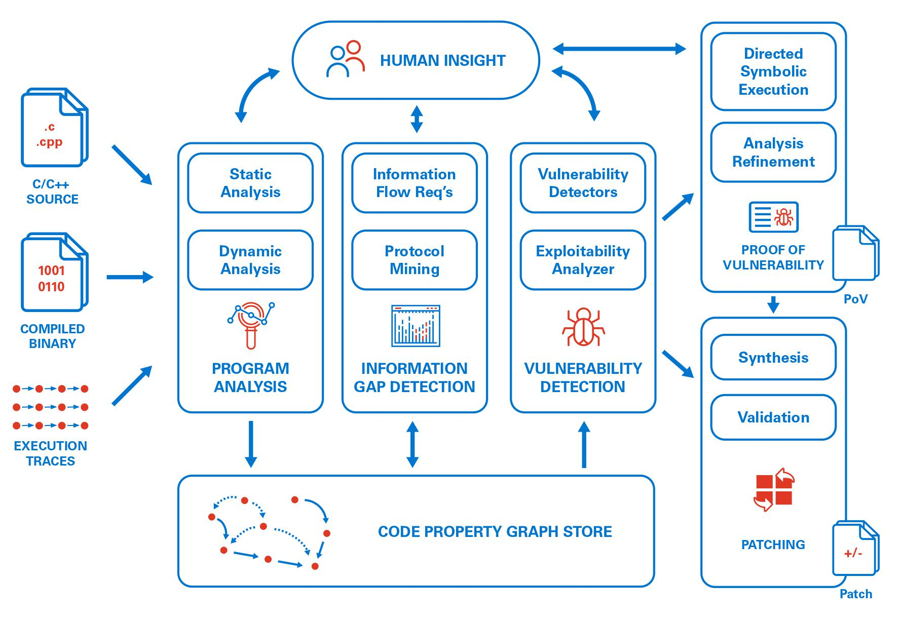
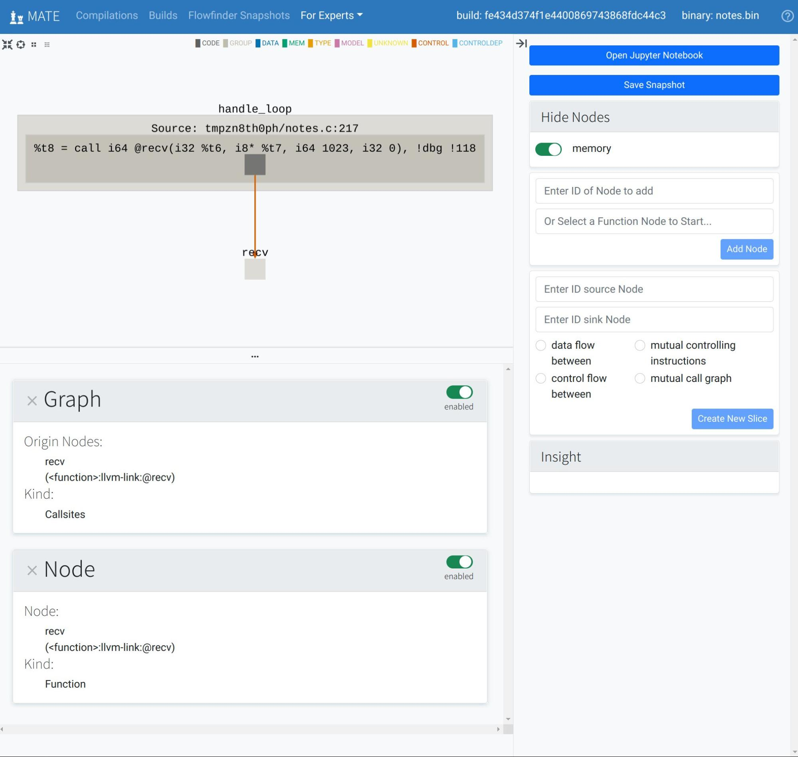
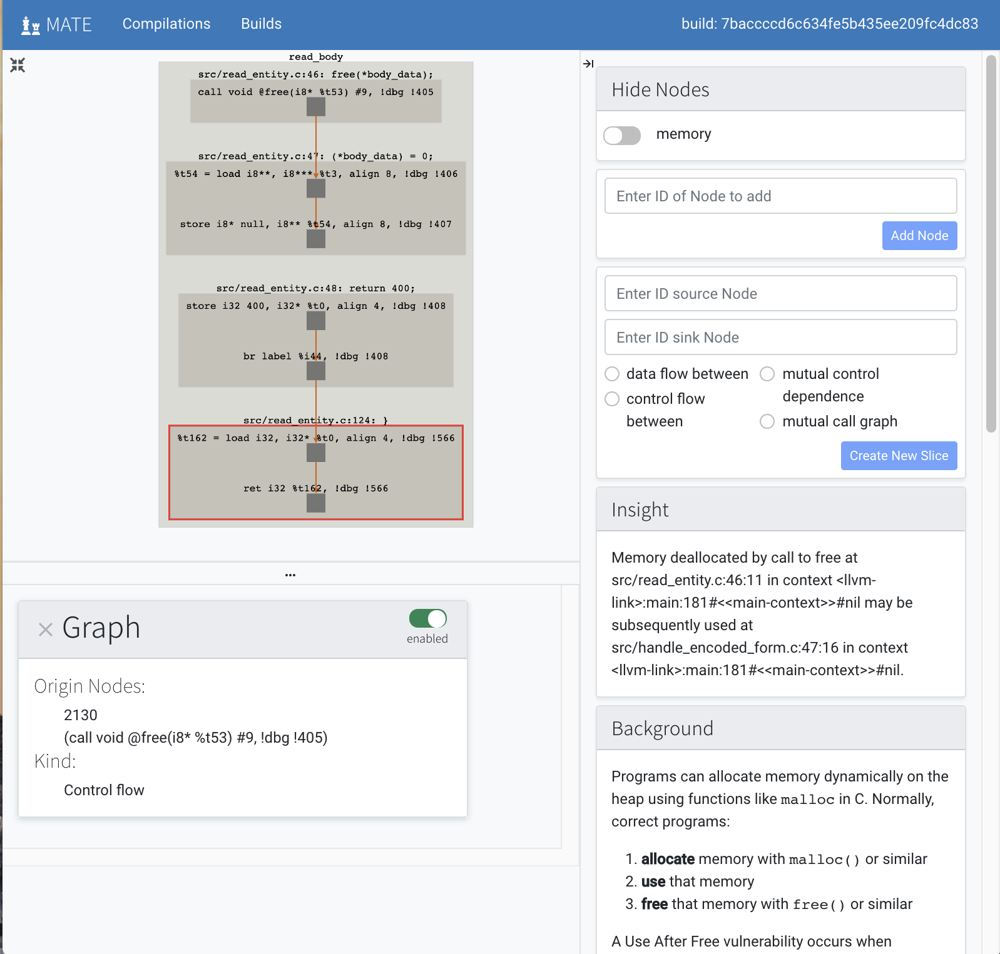
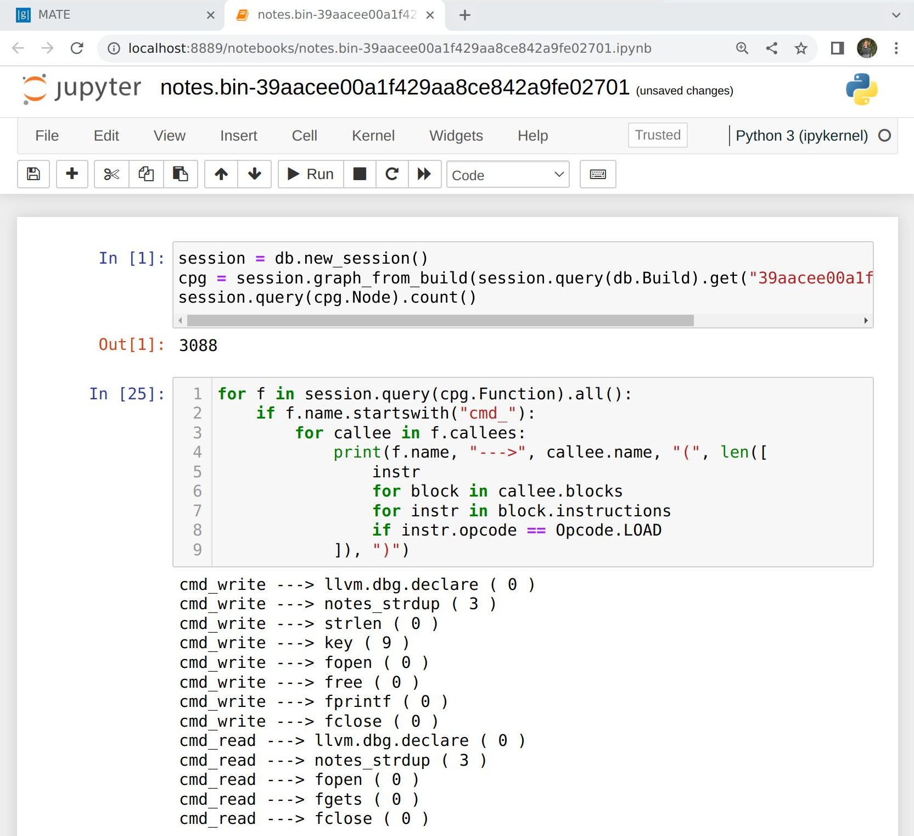
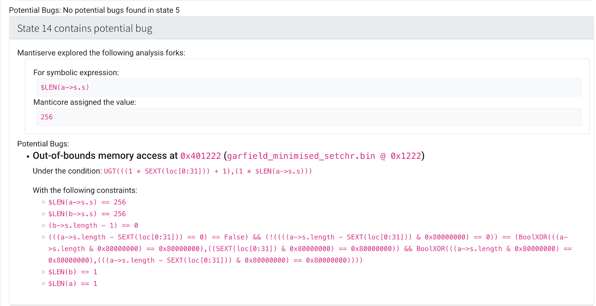

########
Overview
########

.. NOTE::
  This page provides a high-level overview of MATE. To get started using MATE
  right away, see :doc:`quickstart`.

MATE is a suite of tools for interactive program analysis with a focus on
hunting for bugs in C and C++ code. MATE unifies application-specific and
low-level vulnerability analysis using code property graphs (CPGs), enabling the
discovery of highly application-specific vulnerabilities that depend on both
implementation details and the high-level semantics of target C/C++ programs.

..
   The following paragraph is duplicated in cpg.rst; updates to one should be
   reflected in the other.

MATE primarily finds vulnerabilities by static program analysis over the
target's :doc:`CPG <cpg>`, which combines representations of a program’s syntax,
control-flow, and dependencies into a unified graph structure that can be
queried to identify potential flaws. The MATE CPG consists of the target’s:

- abstract syntax tree (AST)
- call graph (CG)
- control-flow graph (CFG)
- inter-procedural control-flow graph (ICFG)
- inter-procedural dataflow-graph (DFG)
- control-dependence graph (CDG)
- points-to graph (PTG)
- source-code to machine-code mapping
- memory layout and DWARF type graph

At a very high level, here's how MATE is used:

- The user inputs the source code of a C or C++ program
- MATE compiles and analyzes the program, creating one CPG per binary
- The user attempts to find vulnerabilities in the program by using :ref:`the
  MATE tools <overview_tools>`

.. _overview_tools:

**********
MATE Tools
**********

..
   The idea is that each section here has about a one- or two-paragraph
   description and an optional screenshot, plus a link to the full documentation
   for each component. For comparison, quickstart.rst has one- or two-sentence
   descriptions, a description of how to start up the component from the builds
   page, plus a link to the component documentation.

   The descriptions are generally taken from the first few paragraphs of the
   respective documentation page, so updates to one should be reflected in the
   other.

MATE provides several tools for exploring and analyzing the program's code
property graph (CPG).

.. _overview_flowfinder:

Flowfinder
==========

Flowfinder is an interactive, graphical, browser-based user interface for
exploring a program's CPG. Given a potential vulnerability discovered via
:ref:`MATE's automated analyses <overview_pois>`, Flowfinder displays relevant
fragments of the CPG that explain relationships between program inputs, outputs,
and computations. Similar to other program analysis tools such as IDA Pro,
Binary Ninja, and angr management, Flowfinder is designed to help answer
questions such as "How does this data get from here to there and how is it
changed along the way" or "If I can control this buffer, what effect can I have
on the execution of the program?" By leveraging the detailed information in the
MATE CPG, Flowfinder is intended to enable interprocedural analysis of program
dataflows at a relatively high level of abstraction. Rather than navigating by
scrolling or jumping between detailed level views of the program's disassembly
or source code, Flowfinder is designed to support expanding and contracting
representations of code and data as needed and creating and manipulating
visualizations of high-level flows between different components.

See :doc:`using-flowfinder` for more information.

.. _overview_pois:

POI Queries
===========

MATE ships with a number of automated analyses that detect potential
vulnerabilities, called Points of Interest (POIs). These detectors are written
using the MATE :ref:`Python query API <overview_query>`; it's easy to write
additional application-, domain-, or API-specific detectors. Potential
vulnerabilities found by these queries can be viewed in :ref:`Flowfinder
<overview_flowfinder>` for collaboration and triage.

See :doc:`pois` for more information.

.. _overview_notebooks:

Notebooks
=========

MATE has :ref:`a Python API <overview_query>` for querying the CPG and exposes
browser-based, interactive Jupyter notebooks with this query interface
pre-loaded. These notebooks can be used to write complex, recursive,
whole-program queries that answer detailed questions like "What sequences of
function calls can lead from point A to point B in this program?" or "Can user
input flow into a memory location with a specific struct type, and from there to
some particular function without passing through one of these three sanitization
routines?" These notebooks can be used for one-off explorations, or as a
platform for users to build reusable apps on the MATE platform (such as
:doc:`usagefinder`).

See :doc:`using-notebooks` for more information.

Under-Constrained Manticore
===========================

MATE provides a web UI for exploring programs with the `Manticore
<https://github.com/trailofbits/manticore>`_ symbolic execution engine in an
*under-constrained* mode. Unlike traditional symbolic execution which begins at
the program entry point and executes until the program exits, under-constrained
symbolic execution starts at an arbitrary function. This specificity means that
under-constrained symbolic execution can analyze parts of programs that would be
too large or complex for traditional symbolic execution.

Symbolic execution enables bit-precise local reasoning about memory and
arithmetic, which complements MATE's higher-level inter-procedural data- and
control-flow analyses.

See :doc:`under-constrained-manticore` for more information.

UsageFinder
===========

UsageFinder is a tool for finding vulnerabilities that result from incorrect
usage of internal or external APIs.

See :doc:`usagefinder` for more details.

.. _overview_internals:

*********************
Other MATE Components
*********************

..
   These are likely less important to users, and so have shorter descriptions.

In addition to the above user-facing tools, the following are a few components
of MATE that can be used to build other tools. For a comprehensive list of
MATE's components, see :doc:`architecture`.

.. _overview_query:

The Query Interface
===================

MATE provides a `SQLAlchemy <https://docs.sqlalchemy.org/en/13/>`_-based Domain
Specific Language (DSL) for querying the CPG, embedded in Python. It has
abstractions relevant to program analysis, for example, control- and data-flow
path queries.

See :ref:`CPG Query API <query-desc>` for more information.

REST API and CLI
================

Much of MATE's functionality is exposed via :doc:`a REST API <using-rest-api>`,
and there is :doc:`a CLI <cli-overview>` for interacting with this API.

.. _overview_pointer:

Pointer Analysis
================

MATE uses a precise, context-sensitive pointer analysis for C and C++ that
allows for accurate, narrow tracking of data- and control-flow through the
program under analysis.

See :ref:`Points-to analysis <points_to_dec>` for more information.

***********
Limitations
***********

MATE has several important limitations:

- MATE analyzes only statically-linked code, so it can't find bugs or follow
  control- and data-flows in dynamically-linked libraries without users writing
  detailed :doc:`signatures` for external code.
- MATE analyzes LLVM bitcode. In practice, obtaining LLVM bitcode requires
  access to the source code, that the project can be compiled using
  clang/clang++, and may require some mucking around with the build system.
  Additionally, it’s much easier to use and understand MATE given familiarity
  with the LLVM language, but such familiarity is fairly uncommon.
- MATE's static analysis is fairly heavy-weight. The :ref:`pointer analysis
  <overview_pointer>` in particular requires a significant amount of time and
  RAM, on the order of hours and up to dozens of GB for large programs.
  Furthermore, these requirements don’t relate predictably to program size or
  other features.
- MATE is still research-grade software. We have worked hard to make it robust,
  but not all of MATE's tools and features will work well on all programs.

**************
Project Status
**************

MATE is not actively developed by Galois, Inc. Please reach out to the email
address "mate at galois dot com" if you'd like to discuss further work on MATE!
