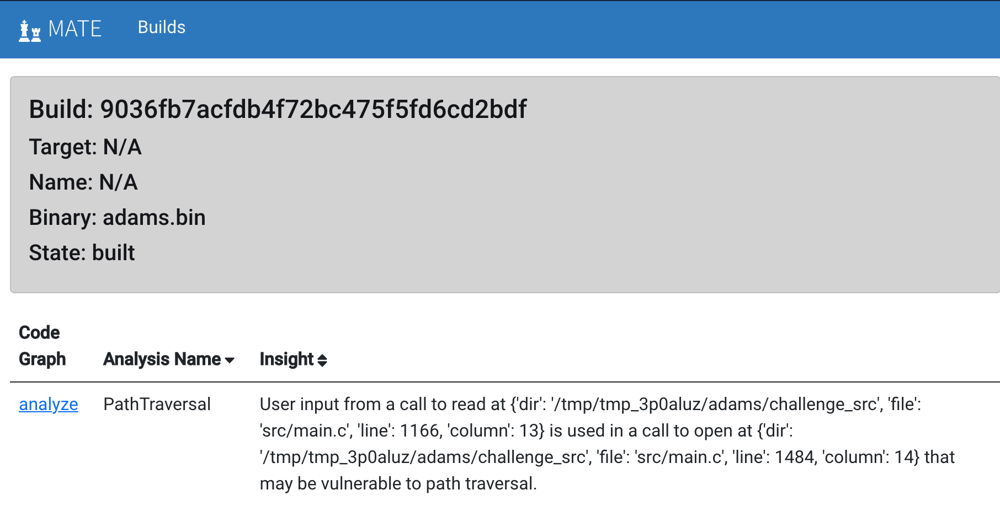
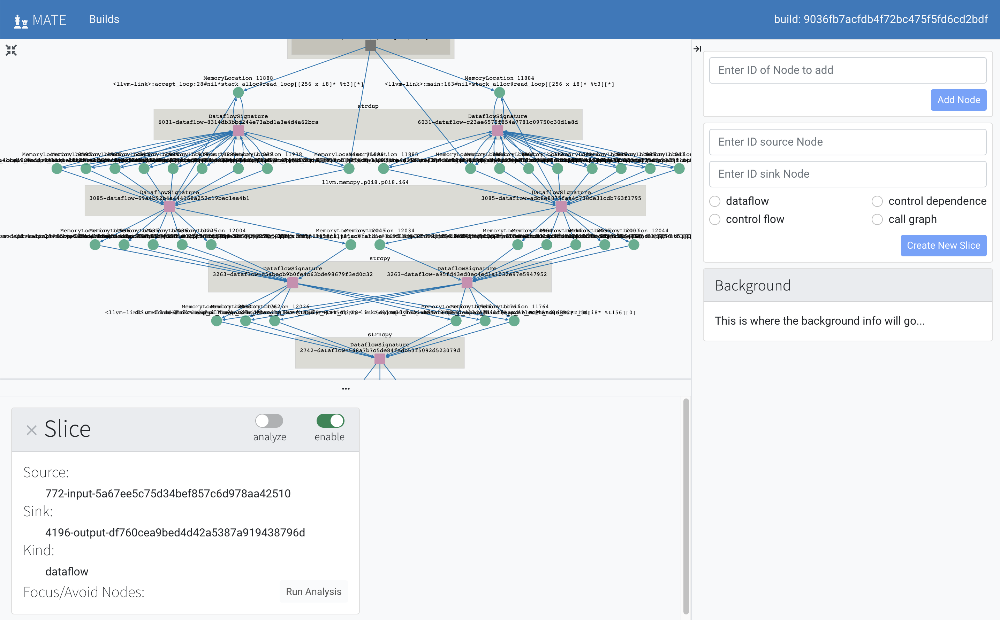

##################
Points of Interest
##################

..
   The first paragraph is duplicated in overview.rst, and the first sentence is
   in quickstart.rst. Updates to one should be reflected in the others.

MATE ships with a number of automated analyses that detect potential
vulnerabilities, called Points of Interest (POIs). These detectors are written
using the MATE `Python API <overview_query>`_; it's easy to write additional
application-, domain-, or API-specific detectors. Potential vulnerabilities
found by these queries can be viewed in `Flowfinder <overview_flowfinder>`_ for
collaboration and triage.

The :doc:`MATE CLI <cli-overview>` and `REST API <api.html>`_ can also be
used to manage POIs and their results; see the ``analyses`` and ``pois``
subcommands of the MATE CLI and the ``/analyses/`` and ``/pois`` endpoints of
the REST API in particular.

For tips on developing POIs, see :doc:`hacking`.

************
Viewing POIs
************

To view the POIs that MATE found for a particular binary, navigate to the MATE
builds page (usually at `<http://localhost:3000/builds>`_) and click "view POIs"
to see a list of POIs.

   The POI page will list POI findings, with links to view each finding in Flowfinder

.. important::
   The list of POIs starts empty. Results are added one-by-one as the MATE analyses running in the background report findings. Refresh the POIs page periodically to see the most up-to-date set of results.

For each POI result, there is:

- "Analysis Name": the type of analysis, see below for details
- "Insight": brief summary of the finding itself
- "Code Graph": click the "analyze" link to visualize this finding in Flowfinder, see :doc:`using-flowfinder` for details

   Visualizing a POI in Flowfinder

*******************
Vulnerability Types
*******************

..
  The POIs below are sorted alphabetically.

MATE automatically reports findings related to the following types of vulnerabilities.

The current release of MATE includes the following built-in POI analyses. The
primary CPG layer(s) used in the analysis are listed at the end of each
description. Each title links to a more complete description of the analysis
below.

* :ref:`CommandInjection`: Finds calls to output functions (e.g. ``write``) with
  potential SQL keywords in string arguments, detecting SQL injection (SQLi)
  vulnerabilities. (AST)

* :ref:`IteratorInvalidation`: Finds uses of C++ iterators subsequent to
  iterator-invalidating collection modifications, detecting vulnerabilities
  resulting from invalid iterator accesses. (CFG)

* :ref:`OverflowableAllocations`: Finds calls to dynamic allocations (e.g.
  ``malloc``) where the size calculation may be influenced by user input,
  detecting unsafe or unintended heap accesses. (DFG)

* :ref:`PathTraversal`: Find calls to filesystem operations where the path may be
  influenced by user input, detecting path traversal vulnerabilities. (DFG)

* :ref:`PointerDisclosure`: Finds pointer-typed values that may be output to the
  user, detecting vulnerabilities that may allow an attacker to circumvent
  memory protections like ASLR and stack canaries. (DFG)

* :ref:`TruncatedInteger`: Finds calls to dynamic allocations where the size may be
  influenced by user input and the input is truncated and used elsewhere as a
  signed integer, detecting vulnerabilities in which an attacker may gain
  control of the heap. (DFG)

* :ref:`UninitializedStackMemory`: Finds potential intra- and inter-procedural uses
  of uninitialized stack memory, detecting potential information leaks or
  computation on invalid data. (CFG, PTG)

* :ref:`UseAfterFree`: Finds potential uses of heap-allocated memory after calls to
  ``free``, detecting UAF vulnerabilities. (CFG, PTG)

* :ref:`UserStringComparisonLength`: Finds string and memory comparison calls where
  the comparison length may be controlled by user input, detecting various
  memory corruption vulnerabilities. (DFG)

* :ref:`VariableLengthStackObject`: Detects uses of C99-style variable-length
  arrays (VLAs) or the alloca library routine where the user can control the
  size of the stack allocation, detecting vulnerability to certain stack-based
  attacks. (DFG)

..
  The below descriptions are taken from the POI class docstrings, updates to one
  should be reflected in the other.

.. _CommandInjection:

Command Injection
=================

*CPG Layer(s): AST*

Programs frequently interact with other programs by building up sequences
of commands and then sending those commands to the target. Common examples
include SQL queries, HTTP requests, and "system" commands.

When command sequences are built up using string functions, command injection
can occur: a malicious user can provide inputs that thew target interprets
as instructions, rather than as data.

For example, the following pseudocode to query a user by ID:

.. code-block::

   query = "SELECT * FROM users WHERE id = " + user_id;

can be manipulated by an attacker to return all rows by providing:

.. code-block::

   user_id = "1234 OR 1=1"

making the final query:

.. code-block:: sql

   SELECT * FROM users WHERE id = 1234 OR 1=1;

which is always true, and therefore returns all users instead
of the intended behavior of just one.

MATE looks for constants that contain keywords associated with command construction,
followed by uses of those constants in string or output formatting functions that
are likely sources of command injection.

.. _IteratorInvalidation:

Iterator Invalidation
=====================

*CPG Layer(s): CFG*

The C++ standard library supports a number of containers (``vector``, ``set``, ``map``, etc). Each
container type has a corresponding iterator type that is designed to allow users to iterate across
and access its elements.

There are some rules around iterator usage. Some container methods cause "iterator invalidation",
meaning that any iterators that were retrieved from the container before the call can only be safely
destructed and are otherwise unsafe to use. For example, the following iterator usage invokes
undefined behaviour:

.. code-block:: c++

   std::vector<int> vec = populate_vec();
   auto iter = vec.begin();
   vec.push_back(1); // invalidates `iter`
   std::cout << *iter; // accesses invalid iterator, UB

MATE finds execution paths where invalid iterators are accessed. It does this by looking for
container methods such as `begin` that return iterators into a given container. It then looks for
invalidating methods on the container found in the previous step. Finally, it checks whether the
iterator from the first step is accessed with ``operator*`` or ``operator->``. If this is the case,
MATE will flag the code as a point of interest. The initial graph loaded for this point of interest
shows:

* The call to the container method that constructed the iterator (e.g. ``begin``)
* The call to the container method that invalidated the iterator (e.g. ``push_back``)
* The usage of the invalid iterator

.. _OverflowableAllocations:

Overflowable Heap Allocations
=============================

*CPG Layer(s): DFG*

C programs can dynamically allocate memory using the `malloc` function.

A common vulnerability occurs when a user controlled value is supplied as the size argument to
`malloc` as part of an arithmetic expression. Consider the following example:

.. code-block:: c

   int *dest = malloc(size + 1);
   memcpy(dest, src, size);

If ``size`` can be controlled to ``0xFFFFFFFF``, the argument to ``malloc`` will evaluate to 0 and
an attacker will be able to write ``0xFFFFFFFF`` bytes of data from ``src`` into the heap at
whatever address ``malloc`` returns.

MATE finds execution paths in the program that take user input (such as a call to ``scanf()``), use
it as part of an arithmetic operation that is susceptible to integer over/under flow and use the
result to control the size of a dynamic memory allocation.

.. _PathTraversal:

Path Traversal
==============

*CPG Layer(s): DFG*

Path traversal (also known as directory traversal) is an attack in which user-provided input results in the program using a filepath that "escapes" the intended part of the filesystem to read or write unauthorized files.
Path traversal exploits often include input that causes unexpected relative path resolution, such as ``../``, which navigates to the enclosing directory, ``//``, which may restart path resolution at the root directory, or ``~``, which may resolve to the current user's home directory. An example attack might include a file path like ``mallory/../../../../path/to/secret.txt``, which "escapes" from the current directory and accesses a secret file.

Sometimes you can insert ``../`` directly into some input that is used to generate a filename - try it!
But often programs include some logic to identify and replace patterns like ``..``.
In these cases, you can sometimes provide encoded input that makes it past these checks, but nevertheless ends up being treated like ``../`` when it is used later in the program.

For example:

- ``%2e%2e%2f``, ``%2e%2e/``, and ``%2e.%2f`` may all be decoded to ``../``
- URL encoding ``..%c0%af`` may also be interpreted as ``../``

Path traversal may be useful to:

- read secret files (e.g. authentication tokens)
- write over important files

MATE reports PathTraversal points of interest, which each include:

- The source location where attacker-controlled input may enter the target program
- The source location where user-controlled data related the the input may be used a filesystem-related function

Each POI result can be opened in Flowfinder, which can be used to explore:

- How is user input used in the construction of the filepath used by the program? Can it take a relative path? Absolute path?
- What functions perform checks and substitutions intended to prevent path traversal? What do they check (and what might they miss)?
- What functions encode/decode input (e.g. URL encoding)? What might they miss: double-encoded values, invalid encodings, etc.?
- Does the program check path data before or after the path has been canonicalized?
- What part of the user input is/isn't checked? Whole path? Filename? Extension?

.. _PointerDisclosure:

Pointer Disclosure
==================

*CPG Layer(s): DFG*

Security mechanisms like Address Space Layout Randomization (ASLR) aim to make it more difficult for attackers to predict where key code and data can be found in memory.
Vulnerabilities that reveal information about the live layout of a program in memory can enable attacks that bypass these security mechanisms.

Pointer disclosure vulnerabilities generally involve programming errors that result in program output that includes the memory address of a value rather than the value itself.
For example, ``printf`` and related string functions take a `format string <https://en.wikipedia.org/wiki/Printf_format_string>`_ and a set of parameters.
The format string tells the string function how to interpret the parameters in order to render them appropriately (e.g. as an integer, as a string, etc.).
If the value to be rendered as an integer, for example, is instead a pointer to an integer, the address in that pointer is "leaked" to the attacker.

MATE provides an analysis that looks for ways that values used as pointers may be passed into functions that produce output.
MATE reports POIs containing:

- The source code location where a pointer is computed
- The source code location where that pointer may be output to the user

Common source of false positives:

- The MATE analysis may not be able to distinguish between code that prints an entire struct (leaking the pointer) and printing the first field of a struct (which is safe) in accesses to code constructs like:

.. code-block:: C

   struct { char msg[8]; void *ptr; }

.. _TruncatedInteger:

Truncated ``malloc`` Size
=========================

*CPG Layer(s): DFG*

A common vulnerability occurs when a user controllable value is supplied as the size argument to
``malloc()`` and used elsewhere as a signed integer.

If the size argument is manipulated to exceed 2GB, the conversion to a signed integer will truncate
the value and result in an extremely negative value (-2GB). If this signed integer is used to
control reads/writes to the allocated memory, it can result in an attacker being able to write to
unexpected portions of the heap.

MATE finds execution paths in the program that take user input (such as a call to ``scanf()``), use it
to control the size of a dynamic memory allocation and then later convert the size to a signed
integer of equal or smaller width.

.. _UninitializedStackMemory:

Uninitialized Stack Memory Use
==============================

*CPG Layer(s): CFG, PTG*

In C and C++ programs, stack variables are not initialized by default.
If a program reads a newly-allocated stack variable before it has been written to, the program will generally contain "junk" data from whatever was last stored at the memory location.
Sometimes junk data is already useful to an adversary (e.g. to easily pass a "check if not ``0``" test), while other times an adversary may be able to control what data is at that location (e.g. content leftover from previous function invocations).

Normally, correct programs have the sequence:

1. **allocation**: reserve space on the stack for the variable near the start of the function
2. **initialization**: write some data to the variable
3. **use**: read data from that variable

MATE detects execution paths such that a **use** of a variable may be reached without passing through an **initialization** of that variable.
MATE reports points of interest that each include:

- The relevant variable name
- Where the variable is declared in the source code
- Where (in the source code) might that variable be used without having first been initialized

Look for:

- How might it be valuable for an adversary to control that variable? How is that variable used (e.g. in conditionals, array indexing, etc.) that might be useful to control?

Common source of false positives:

- Look for relevant calls to external (e.g. library) functions that initialize the variable. MATE can only analyze code included in the program, so relies on :doc:`signatures` to determine whether external library code is capable of initializing variables or not. If we don't have a complete signature, MATE will miss the initialization and report a false positive.
- MATE may report findings based on paths that may not actually be realizable: explore in Flowfinder and/or browsing the source to determine how that point in the code may be reached.

.. _UseAfterFree:

Use After Free (UAF)
====================

*CPG Layer(s): CFG, PTG*

Programs can allocate memory dynamically on the heap, using functions like ``malloc`` in C.
Normally, correct programs:

1. allocate memory with ``malloc()`` or similar
2. **use** that memory
3. **free** that memory with ``free()`` or similar

A Use After Free vulnerability is a condition in which memory is referenced (used) after it has been freed.
This may be useful in a variety of ways, generally related to enabling the attacker to control the data at the **use** site by having previously filled that memory location with advantageous contents.

MATE finds execution paths through the program that pass through a **free**, reaching a **use** site for a variable without having first passing through a (re)allocation function.
The POI results include:

- The source location where a variable's memory is **freed**
- The source location where that variable's memory is **used** without having first been (re)allocated

Recommendation: use Flowfinder to

1. Determine whether the use after free is feasible.
2. Determine how a control of the content of that variable could be useful.
3. Identify how to control the content of that variable. Will the content at the use site point to the previously used content? Can you cause/control a large number of allocations elsewhere so the free memory will likely contain useful values?

Common source of false positives:

- Similar to the uninitialized stack memory POI, if an external function performs the proper (re)allocation between the free and the use site, MATE may not be able to determine this (as MATE only analyzes the code in the program binary).
- Reasoning about dynamic behavior is challenging, and at times cannot be fully precise. In some cases, MATE may report findings that are not actually feasible in practice.
- In particular, a common code pattern results in use-sites that are only reachable if a pointer passes a null-pointer check. If a pointer is set to null after it has been freed, these use sites are not reachable in practice.

.. _UserStringComparisonLength:

User-Controlled String Comparisons
==================================

*CPG Layer(s): DFG*

Some string and memory comparison functions such as ``strncmp`` and ``memcmp`` take
an argument that limits the length of the strings that get compared. For
example, ``strcmp("password", "pass") == 0`` is false, but
``strncmp("password", "pass", 4) == 0`` is true.

If a length-limited comparison function is used in an
authentication check (e.g., to check a user-provided password) and an attacker
can control both the length argument and one of the string arguments, they may
be able to bypass the authentication check.

.. _VariableLengthStackObject:

Variable-Length Stack Allocations
=================================

*CPG Layer(s): DFG*

In most programs, variable-sized objects are dynamically allocated on the heap, and stack objects are fixed in size. There are two exceptions to this:

1. In C99, programmers may use Variable-Length Arrays (VLAs) to create dynamic stack objects
1. In some runtimes, the |alloca|_ library routine can dynamically allocate stack memory

.. |alloca| replace:: ``alloca()``
.. _alloca: https://man7.org/linux/man-pages/man3/alloca.3.html

Dynamic stack objects are inherently dangerous because of the stack's limited space: if a user can add arbitrarily sized objects to the stack, then they can potentially clash the stack with other memory regions in the program (like the heap) or even potentially write backwards from the current stack pointer.

MATE finds execution paths in the program that take user input (such as a call to ``scanf()``) and use that input to control the size of a stack object.
