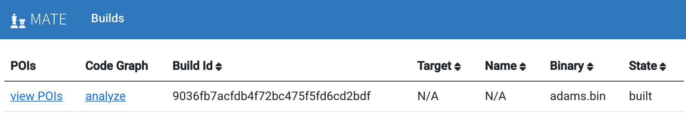

###########
Quick Start
###########

This guide is intended to get you started analyzing a program with MATE as soon
as possible. For more detail on the various steps taken here, refer to the rest
of the documentation.

************
Dependencies
************

You'll need:

* Docker tools to run the MATE services:

    * `Docker <https://www.docker.com/>`_
    * ``docker-compose``

* Python tools to use the CLI:

    * `Python <https://www.python.org/>`_
    * `pip <https://pip.pypa.io/en/stable/>`_

******************
Build and Run MATE
******************

Get the source code:

.. code-block:: bash

    git clone --recurse-submodules https://github.com/GaloisInc/MATE
    cd MATE

Build Docker images with the MATE tools (this may take a long time):

.. code-block:: bash

    docker build --target dist --tag mate-dist .
    docker build --target notebook --tag mate-notebook .
    docker build --target ui --tag mate-ui .

Spin up the MATE services (database, REST API, UI, etc., see :doc:`architecture`
for details):

.. code-block:: bash

    docker-compose -f docker-compose.yml -f docker-compose.ui.yml -f docker-compose.notebook.yml up

Install the CLI. (Run this from the MATE source root. You can install this into a
`virtual environment <https://docs.python.org/3/tutorial/venv.html>`_ if
desired):

.. code-block:: bash

    pip install -r cli-requirements.txt

****************
Upload a Program
****************

You're now ready to provide a C or C++ program to MATE. The program must:

* either be a single standalone C or C++ file, or a Make-based build
* compile with Clang(++)
* have no external/library dependencies (this restriction :ref:`can be avoided
  <mate_cli_basic>`, but we won't cover that here)

A good choice might be ``frontend/test/programs/notes.c`` from the MATE source
tree.

Use the CLI to upload the program (see :ref:`mate-cli oneshot
<mate_cli_oneshot>` for more options):

.. code-block:: bash

    mate-cli oneshot -p program.c

Navigate to the builds page at `<http://localhost:3000/builds>`_ in your web
browser to view the progress in compiling and analyzing your program.

Wait and refresh the page until the status of the build has changed from
"building" or "inserting" to "built". For small programs, this can be a matter
of seconds, for larger programs it can take hours. See :doc:`debugging-builds`
for troubleshooting tips.

*****************
Analyze with MATE
*****************

MATE provides several tools for exploring and analyzing the program's :doc:`code
property graph (CPG) <cpg>`. See :doc:`overview` and the respective
documentation pages for a more thorough description of each of these tools.

..
   The idea is that each section here has about a one- or two-sentence
   description, a link to the full documentation for each component, and a
   description of how to start up the component from the builds page. For
   comparison, overview.rst has one- or two-paragraph descriptions, plus an
   optional screenshot, plus a link to the component docs.

   The descriptions are generally taken from the first paragraph of the
   respective documentation page, so updates to one should be reflected in the
   other.

POIs
====

MATE automatically identifies potential vulnerabilities and reports Points of
Interest (POIs). Click "view POIs" to see a list of POIs for this program.

See :doc:`pois` for more details.

Flowfinder
==========

Flowfinder is an interactive, graphical user interface for exploring a CPG. You
can start Flowfinder from a POI as described above, but you can also start
Flowfinder without viewing a particular POI by clicking "analyze in Flowfinder"
from the builds page.

See :doc:`using-flowfinder` for more details.

Notebooks
=========

MATE provides a `Jupyter Notebook <https://jupyter.org/>`_ server for creating
notebooks that can be used to write custom queries in Python over the CPG. Press
the "Open Jupyter Notebook" button to open a Jupyter/IPython notebook to explore
the program.

See :doc:`using-notebooks` for more details.

Under-Constrained Manticore
===========================

MATE provides a web UI for exploring programs with the `Manticore
<https://github.com/trailofbits/manticore>`_ symbolic execution engine in an
*under-constrained* mode. Press the "analyze in Manticore" button to open the
Under-Constrained Manticore UI.

See :doc:`under-constrained-manticore` for more details.

UsageFinder
===========

UsageFinder is a tool for finding vulnerabilities that result from incorrect
usage of internal or external APIs. Usagefinder can be found at
`<http://localhost:8889/notebooks/examples/usage-finder.ipynb>`_, or by clicking
"For Experts", then "Notebooks" in the top bar of the builds page, then
navigating to the "examples/" folder, then the "usage-finder.ipynb" file.

See :doc:`usagefinder` for more details.
