###########
UsageFinder
###########

..
   The first sentence is duplicated in overview.rst and quickstart.rst. Updates
   to one should be reflected in the others.

UsageFinder is a tool for finding vulnerabilities that result from incorrect usage of internal or external APIs.
It is designed to assist with understanding the relationship between different features and functionalities in a program.

A user of UsageFinder selects functions of interest (an "API" -- regardless of whether the original developer intended it as such or not), and UsageFinder answers questions like:

- How and where are calls to this API used? How are they used together?
- How do API calls relate to each other? By:

  - Control Flow?
  - Operating on the same Values?
  - Operating on related Data (Dataflow)?

- If ``f()`` is called, what *relevant* conditionals control whether or not ``g()`` is called next?

While UsageFinder is included with MATE, it is built entirely as a self-contained Jupyter Notebook App.
It serves as an example of a custom app that can be developed on the MATE platform without requiring any modifications to MATE.
Because the entire implementation is in the notebook, it can be easily inspected and modified.
The UsageFinder UI leverages the built-in `Jupyter widgets <https://ipywidgets.readthedocs.io/en/stable/>`_.

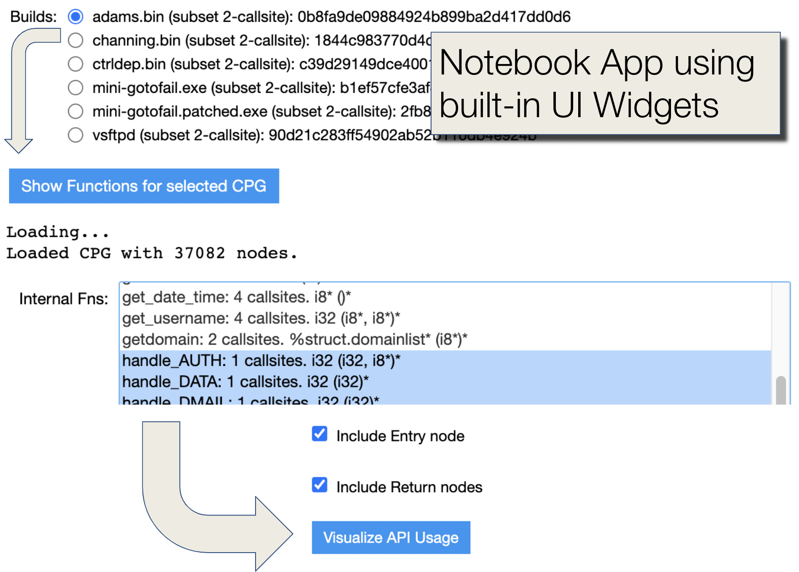

   UsageFinder is used entirely using UI widgets

*********************
Accessing UsageFinder
*********************

UsageFinder is included with MATE, and is available from the ``For Expert->Notebooks`` link on the MATE dashboard: `<http://localhost:8050/>`_

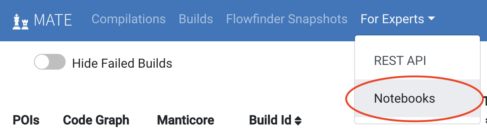

   Access MATE Notebooks from the Dashboard

Then in the Jupyter interface (also available via `<http://localhost:8889/>`_), open ``examples/usage-finder.ipynb``:

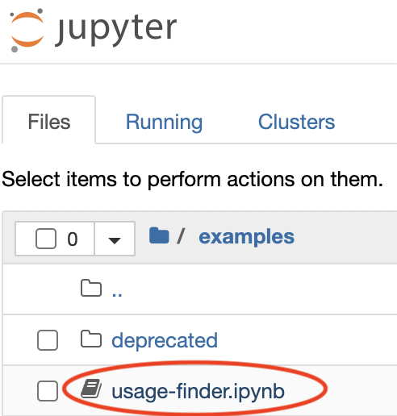

   Open the UsageFinder notebook

In the UsageFinder notebook, activate the contents of the notebook by choosing "Run All" and confirm "Restart kernel and Run All Cells":

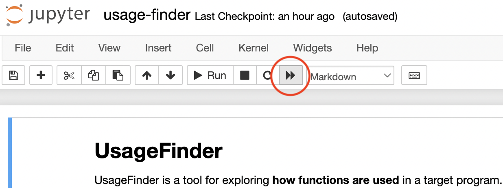

   Activate UsageFinder by clicking Restart kernel and Run All Cells

Now UsageFinder is ready for use.

*********************************
Identifying Functions of Interest
*********************************

The are two sections to the UsageFinder notebook.
The first section is the implementation of the app itself.
Users of UsageFinder should skip to the second section by clicking the "CLICK HERE" links at either the top or bottom of the notebook to jump to the "UsageFinder Users: START HERE" section marking the beginning of the UI widgets for actually using the tool.

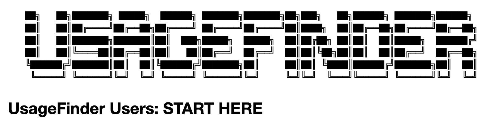

   The UsageFinder banner marks the start of the UsageFinder user interface

The general workflow for interacting with the UsageFinder UI is:

1. scroll down to the next blue button and click it
2. interact with the UI widget(s) in the cell as desired
3. continue to the next blue button and repeat

For example, the first step is to select the desired target program CPG:

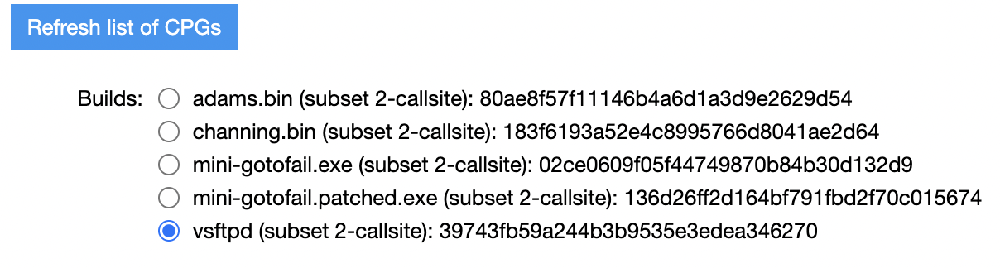

   Click the "Refresh list of CPGs button" then select the CPG of interest (listed by target name, analysis options, and build ID)

Next, click the "Show Functions for selected CPG" button and UsageFinder will show a list of all functions used by the target program along with information about the number of distinct program locations that invoke that function, and the (LLVM) function signature.
Functions are separated into "internal" (implemented within the target program) and "external" lists.
These are **multi-select** widgets, so click and drag, or Control/Command-click to make multiple selections.

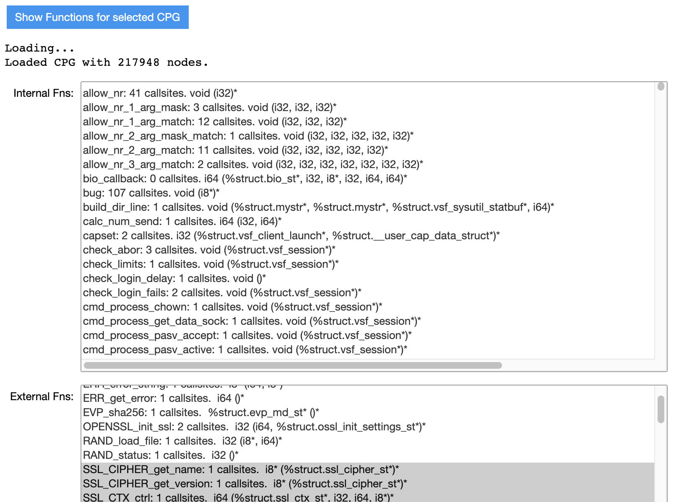

   Click "Show Functions for selected CPG" then use Command/Control-click to multi-select internal and/or external functions of interest

The next blue button is "Show Available API Features."
Click this and UsageFinder will show a multi-select box with a line for each argument and return value for each of the selected functions.
By default UsageFinder generates API Feature tables that use all of these features so there is no need to make any selections here, but if some are known to be not of interest then you can select them here and UsageFinder will generate additional tables that leave those features out of its analysis.

Click the next blue button labeled "Show places where API is used," which will produce a multi-select box with the names of functions with more than one callsite invoking an API function.
This box is sorted by function name, and includes the calling context for the analysis of the function behavior.
Select one or more functions of interest.

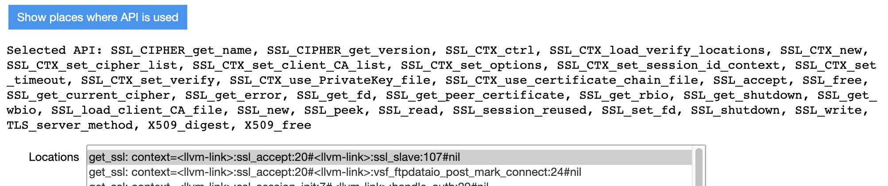

   Select one or more of the functions that make multiple API calls

**************************
Analysis and Visualization
**************************

After selecting API calls of interest and portions of the target program that use the selected API, the next step is to generate visualizations of the UsageFinder analysis:

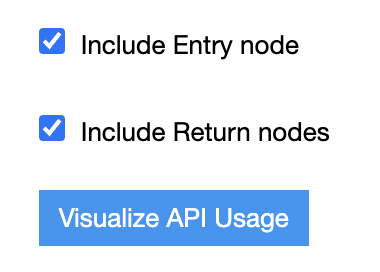

   Check/Uncheck Entry/Return nodes, then click "Visualize API Usage"

UsageFinder will iterate through all of the Locations selected above (functions that make calls to API functions) and produce the following types of visualizations:

API Features Table
==================

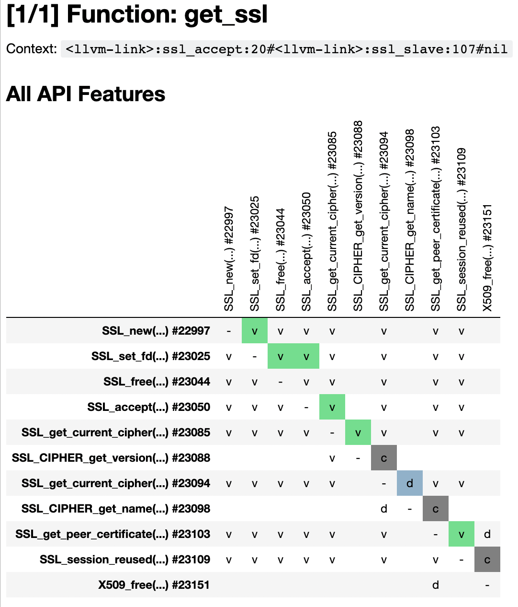

   Example API Features Table for use of SSL functions in ``get_ssl`` function

The goal of this table is to show a dense summarized view of the sequencing of API calls in the function, and how these functions are related by operating on the same values and data.

In the table above, a cell corresponding to row ``f()`` and column ``g()`` is filled with green/blue/gray if after API function callsite ``f()`` is executed, the next API call may be the callsite of ``g()`` (without any other calls to API functions).
The meaning of the colors are as follows:

- green: both calls ``f()`` and ``g()`` operate on some same LLVM Value (e.g. either an argument or return value from ``f()`` is the same value as an argument to ``g()``)
- blue: ``f()`` and ``g()`` do not operate on these Value, but do have shared dataflow via their argument(s) and/or return values
- (dark) gray: ``f()`` and ``g()`` do not have either a Value or Dataflow relationship

The Value relation has priority over Dataflow (if both are present, the table will show the Value relation) as that is a "stronger" relation in some sense.
Similarly the Dataflow relation has priority over the Control Flow relation in the colors used in this table.

The cell text of ``v``, ``d``, and ``c`` correspond to value, dataflow, and control-flow relations.
Functions related by value or dataflow but not by direct control flow sequencing have ``v`` or ``d`` as appropriate as the text of the cell, but no cell background color.

Collapsed Graphs
================

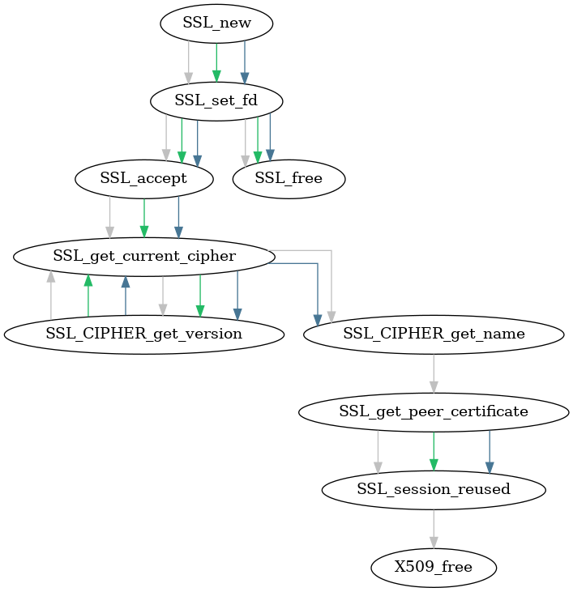

   Example: collapsed graph summary of API Features table above

This visualization summarizes the relation between functions in the API Features Table.
In this view, multiple call sites to the same API function (if any) are "collapsed" into a single node in this visualization.

UsageFinder also produces an additional summary graph showing only dataflow relation between these nodes.

Conditionals
============

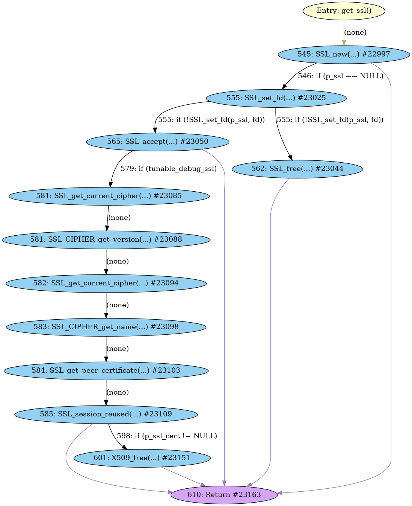

   Example: relevant conditionals between callsites of SSL functions

In this visualization, blue nodes represent calls to API functions.
Edges represent one API call being able to follow another (without any other API call in between) in the control flow of the containing function.
Edges between API nodes are labeled with the relevant source lines (and line numbers) of conditionals that control whether or not the node pointed to is executed or not.
These results leverage MATE's control-dependence analysis in addition to its control-flow analysis.

The "Include Entry node" and "Include Return nodes" checkboxes control whether these items are shown in the graph.
Edges from the entry node are given a yellow/tan color, and edges to Return nodes are purple.
Node labels include CPG node IDs, for further investigation in a MATE notebook or Flowfinder, if desired.

****************
Detailed Reports
****************

UsageFinder also provides more detailed views between (control-flow sequenced) API callsite pairs.
Select pairs of interest by clicking the "Refresh list..." button an interact with the multi-select box:

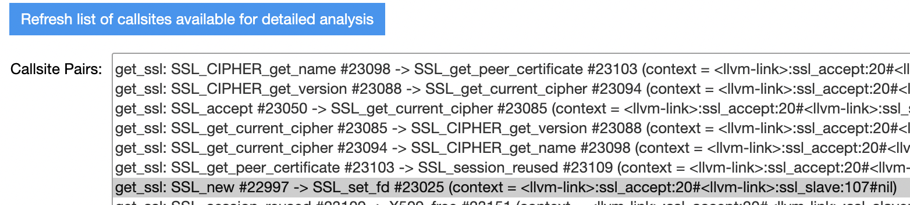

   Example: list of pairs of callsites available for deeper analysis

Then click the "Visualize callsite-pair relationships" button and UsageFinder will produce a table like the following for each selected callsite pair:

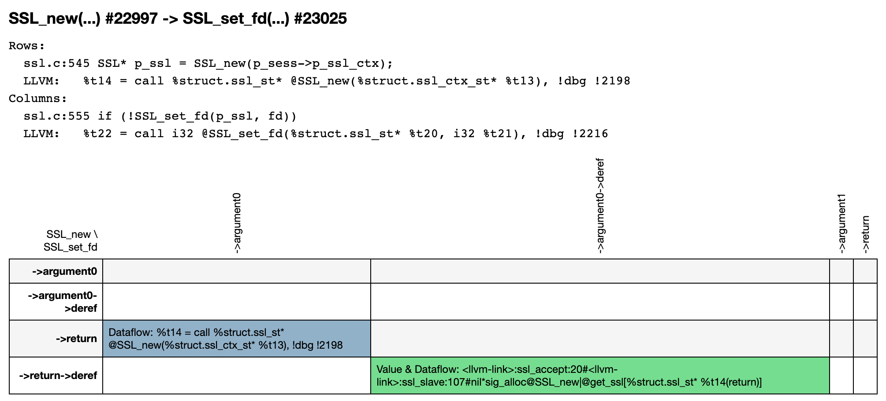

   Example: showing the value returned from ``SSL_new`` is used as the first argument to ``SSL_set_fd``

This table is like the "API Feature" table but shows how arguments and return values relate between the two callsites.
It also shows the relation between dereferenced values, as appropriate.
The source line of code and the LLVM instruction associated with both callsites are printed above each table.
