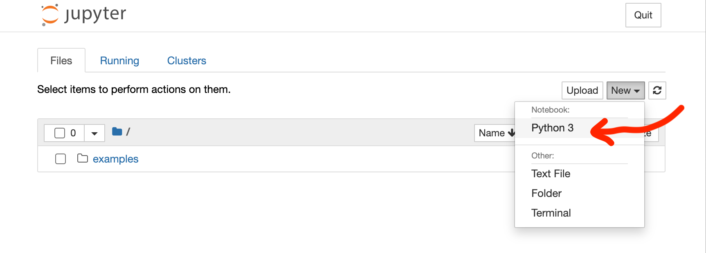
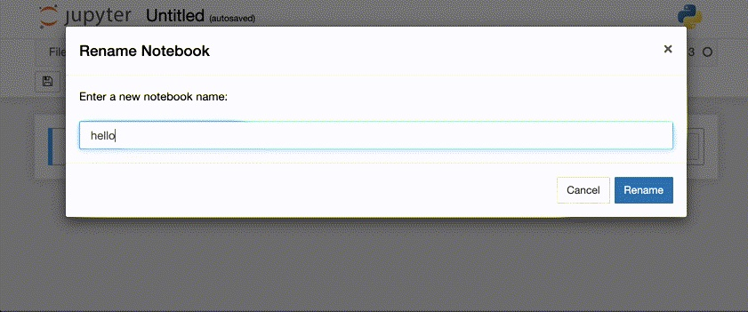
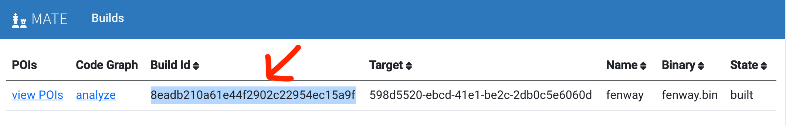
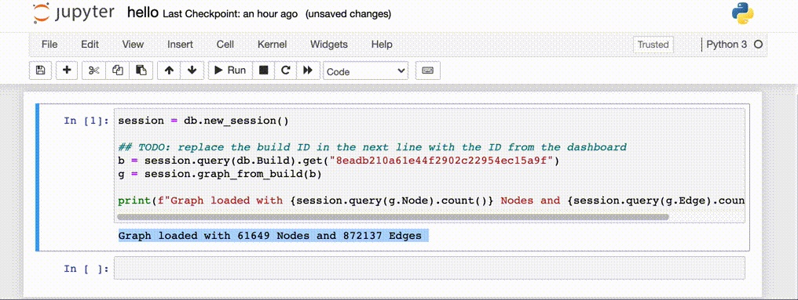
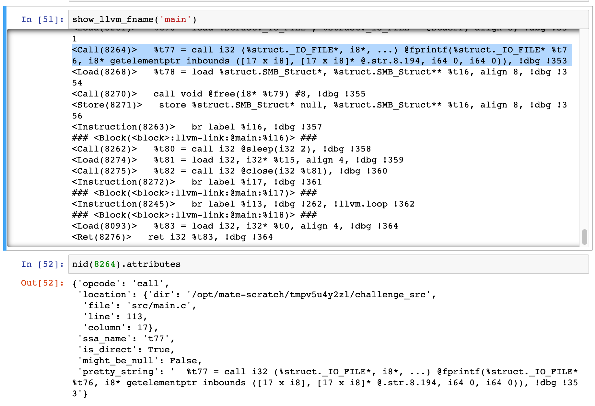

#####################
MATE Python Notebooks
#####################

..
   TODO(lb, #383): mention `help`

MATE provides a `Jupyter Notebook <https://jupyter.org/>`_ server for creating notebooks that can be used to write custom queries in Python of the MATE code property graph.

The MATE notebook server is exposed via web interface: `<http://YOUR_CHESS_SYSTEM:8889/>`_

*****************
Create a notebook
*****************

Navigate to the MATE notebook server at `<http://YOUR_CHESS_SYSTEM:8889/>`_ and use the "New" dropdown to create a new Python3 notebook.

   Create a new Python3 notebook

Optional: click the notebook name (initially "Untitled") to give it a more descriptive name.

   Rename the notebook

************************************
Load the desired code property graph
************************************

Within a python notebook, you need to identify the Code Property Graph you wish to query.
You'll need the Build Id for the target you're interested in.
You can copy it from the MATE dashboard: `<http://YOUR_CHESS_SYSTEM:8050/>`_

   The BuildID for a target

Now, in your MATE notebook enter the following into the first cell, replacing the placeholder Build Id with the one copied from the MATE dashboard:

.. code-block:: python

   session = db.new_session()

   ## TODO: replace the build ID in the next line with the ID from the dashboard
   b = session.query(db.Build).get("fd60a24c857647a4b6707fea56a69db8")
   g = session.graph_from_build(b)

   print(f"Graph loaded with {session.query(g.Node).count()} Nodes and {session.query(g.Edge).count()} Edges")

You'll know it's working if you get nonzero number of nodes and edges as output.

   Loading a CPG in a notebook

*****************************
Query the code property graph
*****************************

The MATE notebook uses
`SQLAlchemy <https://www.sqlalchemy.org/>`_ to expose the CPG as Python objects.
See :doc:`schemata/cpg` for detailed documentation of the content available.

Below are some examples queries.
Each assume ``session``, ``b``, and ``g`` have been initialized as described above.

Print every external (e.g. located in ``libc`` ) function, each followed by a list of all the application functions that invoke it:

.. code-block:: python

   for f in session.query(g.Function).filter_by(is_declaration=True).all():
      print("### '", f.name, "' is invoked by:")
      for c in f.callers:
         print("*", c.name)

CPGs are made of nodes and edges.
Some useful utility functions:

.. code-block:: python

   # print node IDs <-> llvm for a Function object
   def show_llvm(f):
      for b in f.blocks:
         print(f"### {b} ###")
         for i in b.instructions:
               print(f"{i} {i.attributes['pretty_string']}")

   # print node IDs <-> llvm for a Function given a function name
   def show_llvm_fname(fname):
      show_llvm(session.query(g.Function).filter_by(demangled_name=fname).one())

   # helper: turn a node UUID into the corresponding Node object
   def nid(uuid):
      return session.query(g.Node).filter_by(uuid=str(uuid)).one()

   Example: Using the functions above to print LLVM for a function, and using this to access a Node (corresponding to a call to ``fprintf``)
